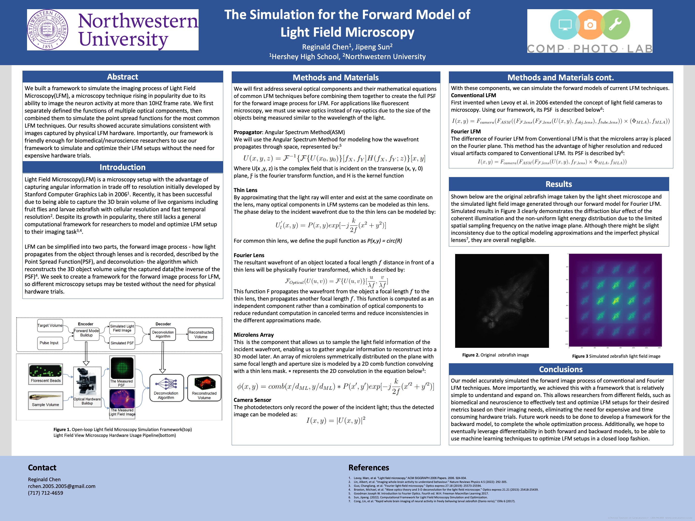

# LFM-Poster
This poster was created by Reginald Chen from Hershey High School and advised by Northwestern University Ph.D student Jipeng Sun.

We built a framework to simulate the imaging process of Light Field Microscopy(LFM), a microscopy technique rising in popularity due to its ability to image the neuron activity at more than 10HZ frame rate. We first separately defined the functions of multiple optical components, then combined them to simulate the point spread functions for the most common LFM techniques. Our results showed accurate simulations consistent with images captured by physical LFM hardware. Importantly, our framework is friendly enough for biomedical/neuroscience researchers to use our framework to simulate and optimize their LFM setups without the need for expensive hardware trials.

